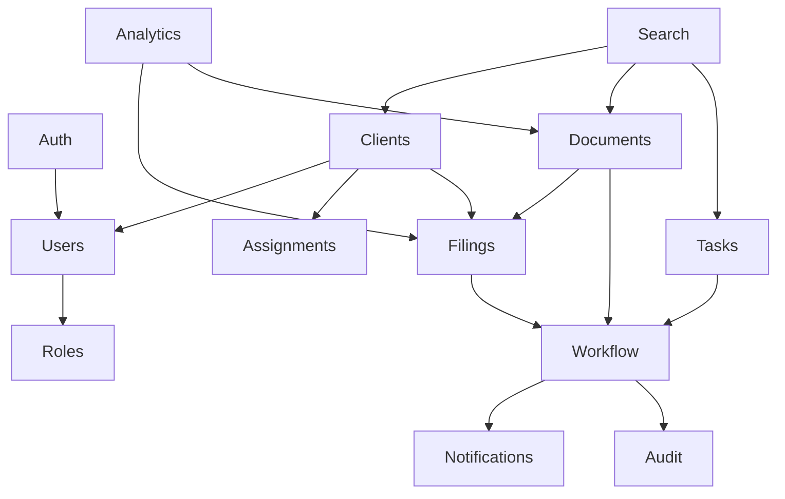

# API Structure

All APIs are versioned under `/api/v1`, use DTO validation, return standardized responses, and enforce authorization through guards.

## Standard Response

```json
{
  "success": true,
  "data": {},
  "meta": {
    "requestId": "uuid",
    "page": 1,
    "limit": 25,
    "total": 100
  },
  "error": null
}
```

## Core Routes

- `POST /auth/login`
- `POST /auth/refresh`
- `POST /auth/logout`
- `POST /auth/change-password`
- `POST /auth/verify-email`
- `POST /auth/verify-phone`
- `GET /me`
- `GET /organizations`
- `POST /organizations`
- `PATCH /organizations/:id`
- `POST /clients/import`
- `GET /clients`
- `POST /clients`
- `GET /clients/:id`
- `PATCH /clients/:id`
- `POST /clients/:id/assign`
- `GET /filings`
- `POST /filings`
- `PATCH /filings/:id/status`
- `POST /documents/requests`
- `GET /documents/requests`
- `POST /documents/requests/:id/upload-url`
- `POST /documents/:id/verify`
- `GET /documents/:id/download-url`
- `GET /tasks`
- `POST /tasks`
- `PATCH /tasks/:id`
- `POST /notes`
- `GET /notifications`
- `PATCH /notifications/:id/read`
- `GET /analytics/dashboard`
- `GET /search?q=...`
- `GET /audit-logs`

## Authorization Model

Each route declares:

- Required authentication state.
- Required tenant context.
- Required permissions.
- Ownership policy, such as assigned client only.

Example policy:

```ts
@RequirePermissions('documents:review')
@TenantScoped()
@AssignedClientOrManager()
PATCH /documents/:id/verify
```

## Pagination And Filtering

Every list endpoint supports:

- `page`
- `limit`
- `sort`
- `order`
- `status`
- date ranges
- module-specific filters

## Module Relationships



