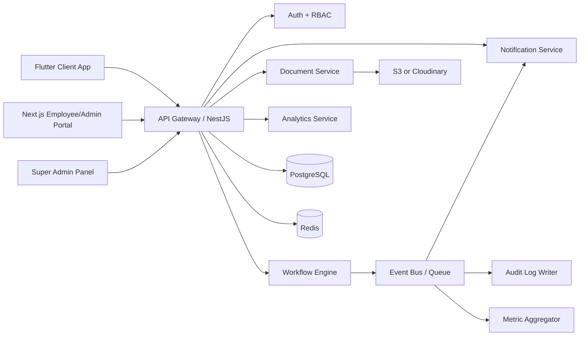

# TaxZone Enterprise Architecture

## Product Scope

TaxZone centralizes operations for chartered accountants, tax consultants, GST practitioners, compliance firms, and financial service organizations. The platform replaces WhatsApp, Excel, manual reminders, and physical file handling with a workflow-driven SaaS ecosystem.

## Primary Surfaces

1. Client Mobile App: Flutter app for document uploads, pending actions, filing progress, notifications, and profile verification.
2. Employee Web Portal: Next.js workspace for assigned clients, document review, workflow updates, notes, tasks, and escalations.
3. Admin Dashboard: Organization-level control center for employees, clients, assignments, analytics, automation rules, and permissions.
4. Super Admin Panel: SaaS operations portal for organizations, subscriptions, platform configuration, usage metrics, and support controls.
5. Backend Platform: NestJS modular API with PostgreSQL, Redis, queues, object storage, notifications, auditing, and analytics jobs.

## Core Architecture

## Architectural Principles

- Every tenant-owned table contains `organization_id`.
- Tenant isolation is enforced by API guards, service policies, repository scopes, database indexes, and optional PostgreSQL Row Level Security.
- Controllers stay thin; business rules live in services and domain workflow handlers.
- Notifications are event-driven and never hardcoded into controllers.
- Documents use signed URLs, validation, metadata records, versioning, and audit events.
- Analytics use scheduled aggregation tables and cached metrics, not heavy dashboard live queries.
- Future AI capabilities are isolated behind asynchronous document intelligence jobs.

## Backend Modules

- Auth: login, MFA-ready flows, refresh token rotation, password policy, first-login enforcement.
- Organizations: firm profile, SaaS status, settings, subscription metadata.
- Users: shared identity model for employees, admins, reviewers, clients, and super admins.
- Roles and Permissions: dynamic RBAC with module/action/resource scopes.
- Clients: client profiles, PAN/GSTIN validation, onboarding imports, assigned staff.
- Employees: departments, workload limits, skill tags, productivity metrics.
- Assignments: manual assignment, reassignment, workload balancing, skill-based rules.
- Filings: filing categories, periods, deadlines, reviewer approval states, workflow linkage.
- Documents: requests, uploads, versions, verification, secure download tokens.
- Workflow: state machines, transitions, timeline events, automation activation.
- Tasks: employee work queue, escalations, priorities, deadlines.
- Notes: internal-only threaded notes with mentions and attachments.
- Notifications: push, email, SMS, WhatsApp delivery orchestration and retries.
- Audit Logs: immutable event records for sensitive actions.
- Analytics: aggregation jobs, dashboards, productivity, SLA, compliance metrics.
- Search: scoped global search over clients, PAN, GSTIN, employees, documents, tasks.

## Data Flow Example

1. Employee requests bank statements for a client.
2. `DocumentRequestCreated` domain event is emitted.
3. Workflow moves to `AWAITING_DOCUMENTS`.
4. Client dashboard receives pending action.
5. Notification jobs are queued for push, email, SMS, and WhatsApp based on preferences.
6. Reminder rules are scheduled from the request due date.
7. Audit log records actor, tenant, IP, user agent, and action metadata.
8. Analytics aggregation marks one more pending document request.

## Scalability Plan

- Horizontally scale NestJS stateless API instances.
- Use Redis for sessions, throttling counters, dashboard cache, and queue coordination.
- Store files in object storage only; never on application disk.
- Partition or archive high-volume audit and notification tables when needed.
- Add read replicas for reporting.
- Use background workers for notifications, imports, OCR, malware scans, and analytics aggregation.
- Use database indexes around `organization_id`, `status`, `assigned_employee_id`, `deadline_at`, PAN, GSTIN, and document request lookups.

