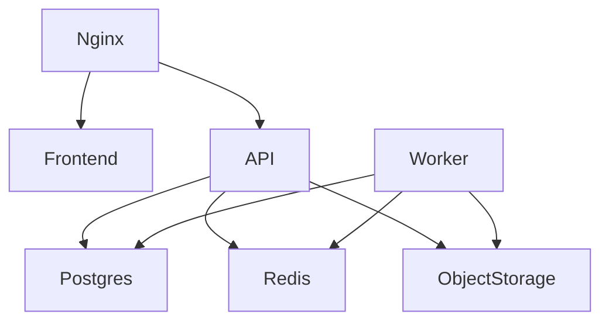

# Deployment Architecture

## Runtime Components

- Next.js frontend served behind Nginx or platform edge hosting.
- NestJS API as stateless containers.
- Worker containers for queues, notifications, imports, reminders, analytics, and future AI jobs.
- PostgreSQL primary database with managed backups.
- Redis for cache, queue coordination, throttling, and ephemeral state.
- S3 or Cloudinary for document storage.
- Observability stack for logs, metrics, traces, and errors.

## Docker Topology

## CI/CD

Pipeline stages:

1. Install dependencies.
2. Lint and typecheck.
3. Unit tests.
4. Integration tests with PostgreSQL and Redis.
5. Security scan.
6. Build Docker images.
7. Run database migrations.
8. Deploy API, workers, and frontend.
9. Smoke test health endpoints.

## Health Checks

- `GET /health/live` for process liveness.
- `GET /health/ready` for database, Redis, storage, and queue readiness.
- Worker heartbeat stored in Redis.

## Backup And Recovery

- Daily PostgreSQL snapshots.
- Point-in-time recovery.
- Object storage lifecycle rules and retention policies.
- Quarterly restore drills.
- Audit logs retained according to compliance policy.

