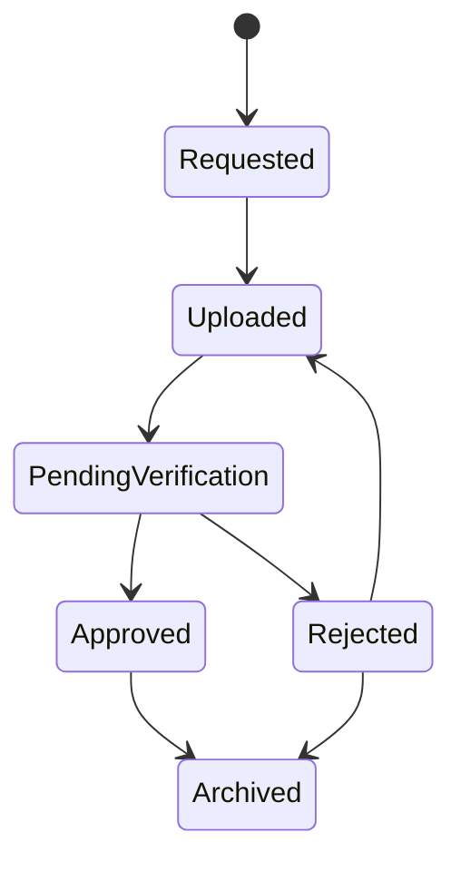
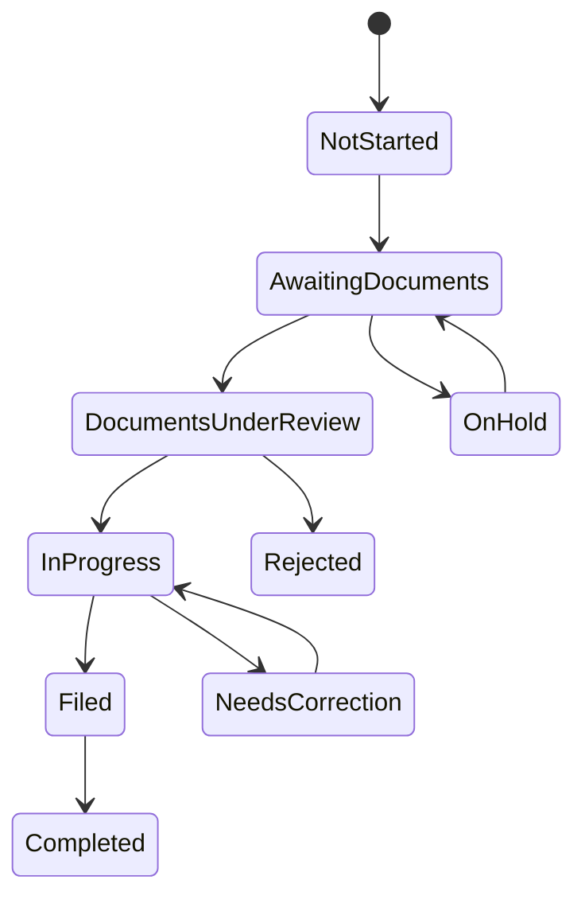

# Workflow Design

## Client Onboarding

1. Organization admin uploads Excel import.
2. Import service validates duplicate PAN, duplicate GSTIN, email format, phone format, and required filing category.
3. Valid rows create client profile, user account, organization relationship, default filing workflow, and initial pending actions.
4. Temporary password is generated and stored as a hash.
5. Credential notifications are queued for email, SMS, and WhatsApp.
6. First login requires password change, phone verification, and email verification.
7. Client dashboard initializes with assigned employee, requested documents, deadlines, and progress.

## Document Request Lifecycle

Every transition emits:

- Audit log
- Timeline event
- Optional notification
- Analytics update

## Filing Workflow

## Assignment Logic

Assignment strategies:

- Manual: manager assigns or reassigns a client.
- Department-based: filing category maps to department.
- Skill-based: employee skills are matched to GST, TDS, income tax, audit, or payroll work.
- Workload-balanced: system prefers qualified employees below workload limit.

## Reminder Rules

Configurable reminder examples:

- Send 3 days before deadline.
- Send 1 day before deadline.
- Send daily after overdue.
- Stop when document request is approved or archived.

Rules are evaluated by background workers and produce notification jobs, not direct provider calls.

